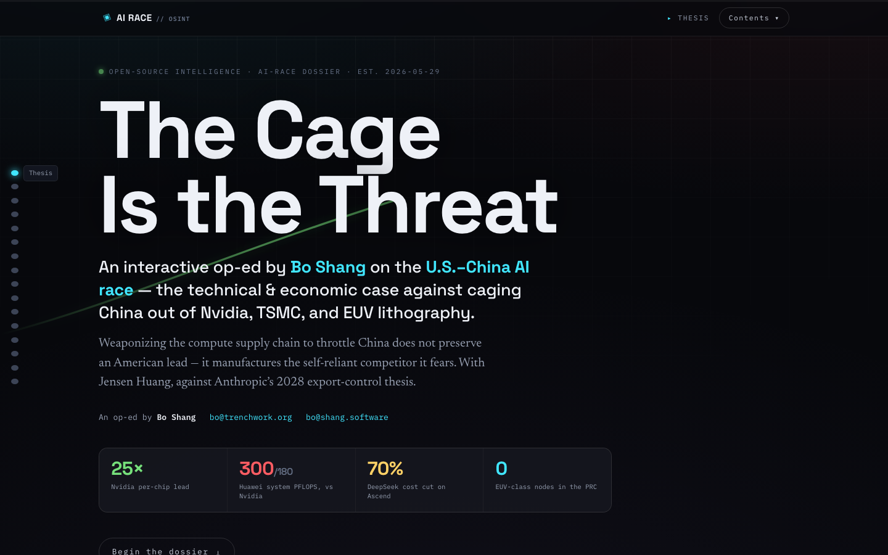
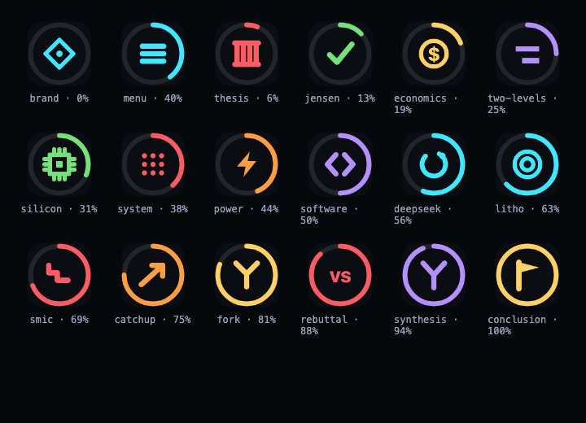

# The Cage Is the Threat

**An interactive intelligence dossier — Bo Shang's op-ed on the U.S.–China AI race.**

🔗 **Live:** https://ai-race-osint.web.app



---

## About

This is a signed, long-form op-ed built as an interactive "intelligence dossier." Its thesis, in one line:

> Weaponizing access to **Nvidia**, **TSMC**, and **ASML's EUV lithography** to throttle China does not preserve an American lead — it manufactures the self-reliant competitor it fears.

It sides with **Jensen Huang** and argues against the prescription in Anthropic's *“2028: Two scenarios for global AI leadership.”* The argument is built on a two-level frame that runs through the whole piece:

- **Level 1 — the chip:** Nvidia wins decisively (~32× per accelerator; SMIC's DUV ~7nm is two-to-three nodes behind TSMC's leading edge).
- **Level 2 — the system:** Huawei competes by scaling out — CloudMatrix 384 (384 Ascend 910C) beats the GB200 NVL72 on aggregate FLOPS (~300 vs ~180 PF)…
- **Level 3 — the grid:** …at 4.1× the power, which is exactly the trade China can afford (cheap energy as the slack variable).
- **Level 4 — the moat:** CUDA vs CANN — and every export control is, in effect, a forced-migration program that matures the rival stack.

It then walks the SMIC-vs-TSMC technical gap, the Taiwan/Western-vs-PRC lithography map, the catch-up mechanisms (SMEE, SiCarrier, CXMT, Big Fund III), and answers Anthropic point by point.

*— Bo Shang · [bo@trenchwork.org](mailto:bo@trenchwork.org) · [bo@shang.software](mailto:bo@shang.software)*

---

## Features

**Interactive visualizations** (all hand-built SVG/Canvas/CSS — no charting libraries):

| Component | What it shows |
|---|---|
| Two-level toggle | Flip between "the chip" and "the system" — the winner inverts |
| Per-chip chart | FP4 PFLOPS per accelerator; the ~32× gap |
| System chart | 384-vs-72 chip dot-grid + aggregate PFLOPS |
| Power gauges | 4.1× power / 2.5× per-FLOP, with kW bars |
| Yield, aggregate, pricing | SMIC vs TSMC yield; Huawei % of Nvidia; illustrative cost index |
| Lithography ladder | The EUV "wall" — allied EUV nodes vs SMIC's DUV |
| Foundry map | Who holds EUV (West/Allied vs PRC) |
| Catch-up timeline | 2019 → 2028 milestones |
| Scenario toggle | Anthropic's Scenario 1 ⇄ 2, with Bo's annotations |
| Rebuttal accordion | 10-point point-by-point response |

**Navigation & UX:** scroll-spy top bar, contents overlay, desktop side rail, reading-progress bar, floating chapter dock (prev/next + position + back-to-top), keyboard nav (`←` / `→` / `Esc`), deep-link anchors, and a print-friendly static mode (`?still`).

**Dynamic favicon** — a canvas-rendered tab icon that reflects what you're reading: a reading-progress ring plus a per-chapter glyph in the chapter's accent color. The tab title updates too (`07/16 · The System — …`).



**Firebase Analytics** — lazy-loaded, with custom engagement events: `section_view` (per chapter) and `scroll_depth` (25/50/75/100%).

---

## Tech stack

- **[Angular 21](https://angular.dev)** — standalone components, **signals**, **zoneless** change detection
- Bespoke **SVG / Canvas / CSS** visualizations (zero chart dependencies)
- **Firebase Hosting** + **Firebase Analytics** (lazy-loaded)
- Type styling: Space Grotesk (display) · Newsreader (serif body) · IBM Plex Mono (data)

Initial bundle ≈ 110 KB transfer (Firebase split into lazy chunks).

---

## Project structure

```
.
├── firebase.json            # Hosting config (public: web/dist/web/browser, SPA rewrite, caching)
├── .firebaserc              # Firebase project: ai-race-osint
├── docs/                    # README assets
└── web/                     # Angular app
    └── src/
        ├── index.html       # meta, fonts, boot loader
        ├── styles.scss      # design system (tokens, sections, panels, reveal)
        └── app/
            ├── app.ts        # shell: nav, scroll-spy, dock, favicon + analytics effects
            ├── app.html      # hero + interleaved narrative + footer
            ├── content.ts    # the dossier as data (sections, rebuttal, datasets, scenarios)
            ├── content.model.ts
            ├── content.service.ts
            ├── favicon.service.ts   # canvas dynamic favicon
            ├── shared/              # reveal directive, count-up, markup helper
            └── components/          # section + 12 visualization components
```

---

## Development

```bash
cd web
npm install
npm start            # ng serve → http://localhost:4200
npm run build        # production build → dist/web/browser
```

Requires Node 20+ and Angular CLI 21 (`npx ng …` works without a global install).

---

## Deployment

The site deploys to Firebase Hosting (project `ai-race-osint`):

```bash
cd web && npm run build           # outputs to web/dist/web/browser
firebase deploy --only hosting --project ai-race-osint
```

`firebase.json` serves `web/dist/web/browser`, rewrites all routes to `index.html` (SPA), and applies immutable caching to hashed assets with `no-cache` on `index.html`.

---

## Content & methodology

The prose, the 10-point rebuttal matrix, and the chart datasets were drafted and fact-checked with a multi-agent research workflow, then verified against public reporting (SemiAnalysis, CFR, Tom's Hardware, FT, and company roadmaps) in a second adversarial pass.

**This is an opinion piece.** Technical figures reflect public reporting as of mid-2026; **prices, model names, and forward projections (e.g., DeepSeek-V4-Pro vs Opus 4.8 / Mythos pricing, the 2028 scenarios) are illustrative or forward-looking**, not statements of established fact. The views are the author's own.

---

## License & credits

© Bo Shang. The text is the author's opinion; reuse with attribution.

Built with [Claude Code](https://claude.com/claude-code).
